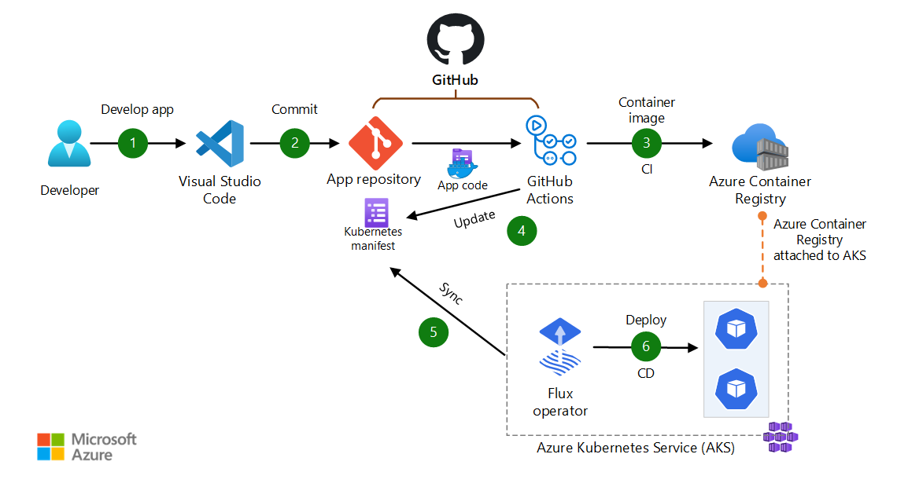

# Kubernetes Flux Hack

Welcome to the Kubernetes Flux Hack! This guided hack will walk you through the process of setting up a Kubernetes cluster, installing Flux on the cluster, and implementing a GitOps flow within your repository.

## Pre-requisites

1. Existing Azure Account
2. Existing Github accoun

## What Is

There are a lot of terms in Kubernetes Land. Here's a helpful list of terms that will be relevant and useful.

### Kubernetes

Kubernetes is an open-source container orchestration platform that automates the deployment, scaling, and management of containerized applications.

### Helm

Helm is a package manager for Kubernetes that simplifies the deployment and management of applications. Helm charts are pre-configured templates that define the structure and configuration of Kubernetes resources. They are useful because they enable easy sharing and reusability of application configurations, making it faster and more efficient to deploy complex applications on Kubernetes.

### Operators

Kubernetes Operators are a method of packaging, deploying, and managing a Kubernetes application. They extend the functionality of Kubernetes by introducing custom resources and controllers that automate the management of complex applications or services. Operators are typically used to manage stateful applications and provide additional operational capabilities such as automated scaling, backup and restore, and configuration management. Flux and Argo are both Kubernetes operators.

### GitOps

GitOps is the practice of using Git as a single source of truth for declaratively specifying the desired state of infrastructure and applications. GitOps provides increased reliability and velocity, reduced downtime, and self-healing. Argo CD and Flux are the most popular options for GitOps continuous deployment.

### Flux

Flux CD is a Kubernetes operator that enables GitOps continuous deployment. It automates the deployment and management of applications on Kubernetes by continuously monitoring a Git repository for changes and applying those changes to the cluster. Flux CD is useful for maintaining a desired state of infrastructure and applications, ensuring reliability, reducing downtime, and enabling self-healing. It integrates with Helm charts and can automatically update Kubernetes manifest files when new container images are pushed.

Most crucially, it integrates well with Azure Arc, which we will be using today.

## What will we do today?

This hack will take you through:

1. Setting up an Arc enabled cluster.
2. Installing Flux CD on the cluster
3. Setting up a Github Actions workflow to build and push images to ACR
4. Setting up a Kubernetes secret to enable Flux CD access to a private Github repository
5. Setting up Flux CD to monitor for application changes and keep a cluster in sync
6. Setting up an Actions workflow to automatically update Kubernetes manifest files when a new container image is pushed

## Architecture

This is the eventual architecture we will implement:

Data flow:

1. App code is developed or changed in an IDE
2. Code is committed to Github
3. Github Actions builds a container image and pushes the image to ACR
4. Github Actions updates a Kubernetes Manifest deployment file with the latest image version based on a version number in ACR
5. Flux the Git repository
6. Flux deploys the newest image to the AKS cluster

## Contributing

If you find any issues or have suggestions for improvements, feel free to open an issue or submit a pull request.

## License

This project is licensed under the [MIT License](LICENSE).
